# Анатомический эрмитаж

Сайт музея анатомии при ПСПбГМУ им. И. П. Павлова (Санкт-Петербург, Петроградский район).
Учебный дизайн-проект: концепция, арт-дирекшн, дизайн-система и фронтенд.

> **Демо:** _URL после деплоя на Vercel_ → `https://<project>.vercel.app`

---

## Задача

Музей закрытого типа при действующей кафедре: попасть можно только по предварительной
записи и только в будний день. Это не аттракцион и не кабинет редкостей — академическая
институция с почти двухвековым собранием, которое до сих пор используется в учебном
процессе.

Отсюда две главные задачи сайта:

1. **Снять неверные ожидания.** Человек, ищущий «жуткий музей», должен понять, что здесь
   другое. Человек, которому интересно устройство тела, — что здесь именно то, что нужно.
2. **Объяснить порядок посещения** так, чтобы правило «только по записи» не выглядело
   бюрократией, а читалось как следствие того, что залы одновременно являются учебными
   помещениями.

**Аудитория:** студенты-медики и преподаватели, школьные группы 14+, взрослые посетители
с интересом к истории науки, иностранные гости.

---

## Концепция — «Свет как метод познания»

Единственный источник драматургии на сайте — свет, а не сам материал экспозиции.
Никакой хоррор-эстетики: медицинский контент подаётся как музейная документалистика.

Смысловое ядро — рентгенологический зал, где свет идёт не сверху, а из стен. Он же
единственная тёмная секция всего сайта: остальные страницы светлые, и переход в этот
блок физически ощущается как вход в затемнённый зал.

Навигация оформлена как маршрут по залам: моно-этикетки «ЗАЛ 01 · ЭКСПОЗИЦИЯ», шторка
перехода между страницами с подписью следующего зала, инвентарные номера у экспонатов.

---

## Палитра

Светлая, холодная, с одним тёплым нейтральным тоном. Соотношение примерно 70 / 20 / 10:
нейтраль — синий — голубой.

| Токен | HEX | Роль |
| --- | --- | --- |
| `paper` | `#FCFBF7` | Основной фон. Белый с едва тёплым оттенком — не стерильный |
| `linen` | `#F2ECE1` | Бежевые поверхности: чередующиеся секции, подложка 3D-схемы |
| `sand` | `#E3D8C6` | Разделители, рамки витрин |
| `navy` | `#13294B` | Текст и «тёмные залы». Глубокий синий вместо чёрного — мягче на светлом фоне |
| `slate` | `#4C637C` | Вторичный текст, подписи |
| `azure` | `#2E6BAA` | Акцент: ссылки, этикетки, активные состояния. Контраст с `paper` — 5.8:1 |
| `sky` | `#8CC0E4` | Голубой: свечение рентгена, акценты внутри тёмных секций |
| `mist` | `#DCEAF4` | Светло-голубой фон акцентных блоков |

**Почему так.** Синий и голубой — это цвет рентгеновского негатоскопа и холодного
музейного света; бежевый и белый — цвет кости, гипса и архивной бумаги. Палитра
работает на главную метафору и при этом полностью снимает «анатомический» шок-эффект,
который дала бы красная гамма.

Фотографии не перекрашивались в файлах: единый цветокор задан слоем (`.plate` в
`globals.css`) — приглушение насыщенности, холодный градиент и лёгкий грейн. Оригиналы
остаются нетронутыми, а весь фотоархив выглядит как одна съёмка.

---

## Типографика

Пять гарнитур, у каждой своя роль. Кириллица подключена во всех.

| Роль | Гарнитура | Где используется |
| --- | --- | --- |
| Display | **Playfair Display** | H1—H2, крупные заголовки. Высокий контраст штриха — прямая отсылка к гравюрам анатомических атласов |
| Заголовки 3-го уровня | **Unbounded** | H3—H4, названия правил и вопросов FAQ |
| Body | **Inter** | Основной текст, 17—19px, интерлиньяж 1.65 |
| Технические подписи | **IBM Plex Mono** | Этикетки, номера залов, инвентарные номера, счётчики. Uppercase, трекинг +0.12em |
| Врезки | **Cormorant Garamond** | Кураторские цитаты и отзывы, италик |

Шкала — fluid через `clamp()`, модуль 1.25—1.333, задана в `tailwind.config.ts`.

**Две правки после первого ревью:**

- Из заголовков убран италик. Кириллический италик Playfair Display на крупных кеглях
  разваливается по ритму — оставлено прямое начертание, акцент делается цветом.
- Reveal-маски заголовков получили запас снизу и справа
  (`padding-bottom: 0.24em; margin-bottom: -0.24em`). Без него маска срезала выносные
  элементы «у», «р», «д» и правые свесы антиквы.

Space Grotesk из исходного брифа заменён на Unbounded, Manrope — на Inter,
JetBrains Mono — на IBM Plex Mono: у первого нет кириллицы, остальные два уступают
в разборчивости на мелком кегле.

---

## 3D

Вся геометрия процедурная — ни одного внешнего ассета, поэтому сцена не тянет
мегабайты моделей и не зависит от CDN.

**Грудная клетка** (`lib/anatomy.ts`) — 12 пар рёбер, позвоночный столб и грудина.
Ключевая деталь: дуга ребра лежит в **горизонтальной** плоскости и идёт от позвоночника
через бок вперёд. Первая версия строила дуги в вертикальной плоскости, из-за чего левая
и правая стороны совпадали и объект читался как бочка с обручами. Обхват максимален на
6—8 паре, две нижние пары — «колеблющиеся», короткие.

Вся геометрия сливается в один буфер через `mergeGeometries`: одна отрисовка вместо
полусотни мешей.

**Материал** — матовая кость (`roughness: 0.88`, без прозрачности). Стеклянный
`MeshTransmissionMaterial` из первой версии давал «мокрый» блик, неуместный для сухого
костного препарата. От него остался только едва заметный френель-контур холодного
оттенка — след рентгеновской подсветки.

**Сцены:**

- `HeroScene` — грудная клетка, реагирует на курсор с инерцией (демпфирование, а не
  прыжок за мышью), скролл доворачивает и опускает объект.
- `BodyExplorer` (страница «Экспозиция») — та же клетка плюс череп, шейный и поясничный
  отделы, плечевой пояс и таз. Пять hotspot-точек: по клику камера и точка взгляда
  одновременно демпфируются к разделу, справа выезжает панель с описанием.
- `LostExhibit` (404) — пустой музейный сосуд.
- `SceneFallback` — SVG-схема грудной клетки. Показывается, если WebGL недоступен.

Постпроцессинг (bloom, виньетка) снят вместе с переходом на светлую тему: на белом фоне
он только грязнил картинку и стоил кадров.

---

## Моушн

- **Lenis** — инерционный скролл, синхронизирован с тикером GSAP, чтобы ScrollTrigger
  считал позиции в том же кадре.
- **Page transitions** — светлая шторка с моно-подписью следующего зала. В App Router нет
  надёжных exit-анимаций страниц, поэтому шторка живёт в layout и управляется вручную:
  закрытие по клику, открытие — по смене `pathname`.
- **Split-text reveal** по словам и буквам на всех заголовках.
- **Pinned horizontal scroll** в блоке залов (GSAP `matchMedia`, только на десктопе —
  на мобильном это обычная вертикальная лента).
- **Clip-path reveal** изображений снизу вверх — как проявление снимка.
- **SVG-таймлайн** истории: линия рисуется по `pathLength` при прокрутке, кадры едут
  с собственным параллаксом.
- **Курсор-визир** — рамка кадрирования из четырёх уголков с подписью действия.
  Системный указатель намеренно не скрывается: визир работает как подсказка, а не как
  замена курсору.
- **Магнитные кнопки**, draggable-лента отзывов с инерцией, многошаговая форма
  с направленными переходами.

Всё уважает `prefers-reduced-motion`: Lenis не запускается, курсор не подключается,
объект в hero замирает вполоборота.

---

## Структура

| Маршрут | Содержание |
| --- | --- |
| `/` | Hero с 3D, манифест со счётчиками, залы (pinned horizontal), рентген-зал, отзывы, CTA |
| `/exposition` | Интерактивная 3D-схема с hotspot-точками, сетка собрания с фильтрами, лайтбокс-этикетка |
| `/excursions` | Пять форматов, акцент-блок про запись, трёхшаговая форма с валидацией |
| `/history` | Scroll-таймлайн от 1897 года, блок о хранителях |
| `/visitors` | Правила, как добраться, FAQ-аккордеон |
| `/contacts` | Монументальная типографика, схема района, форма обратной связи |
| `not-found` | Кастомная 404 с «потерянным экспонатом» в 3D |

---

## Стек

Next.js 15 (App Router) · TypeScript · Tailwind CSS · Framer Motion · GSAP + ScrollTrigger ·
Lenis · React Three Fiber + drei.

---

## Скриншоты

| | |
| --- | --- |
| 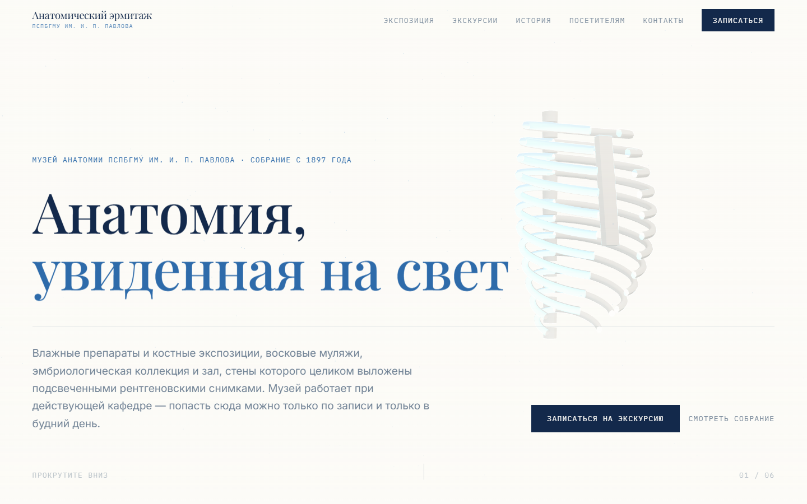 | 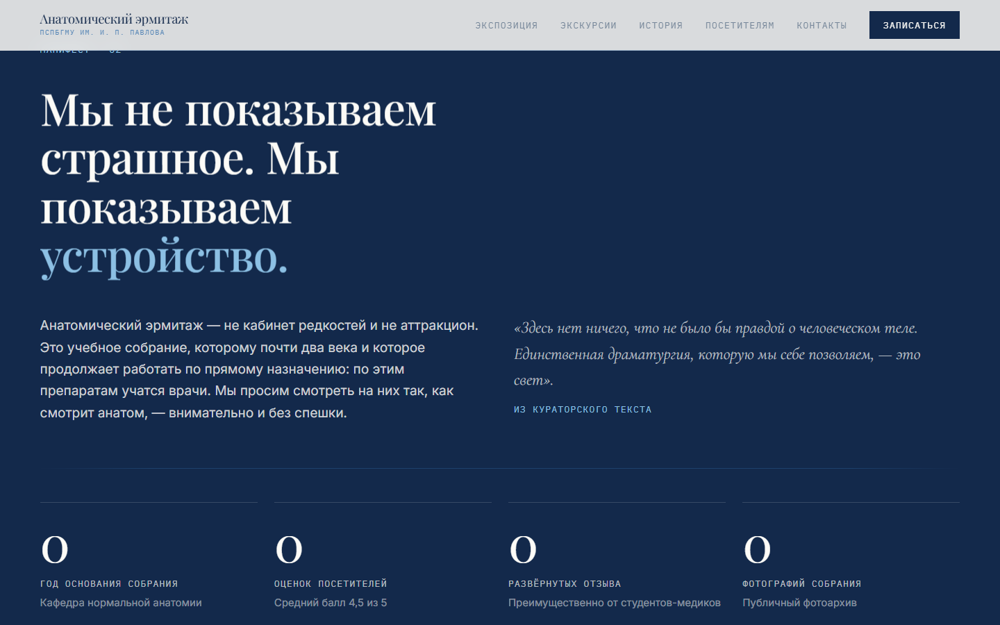 |
| 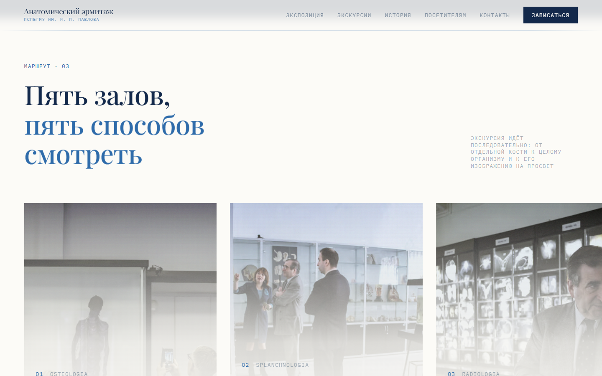 | 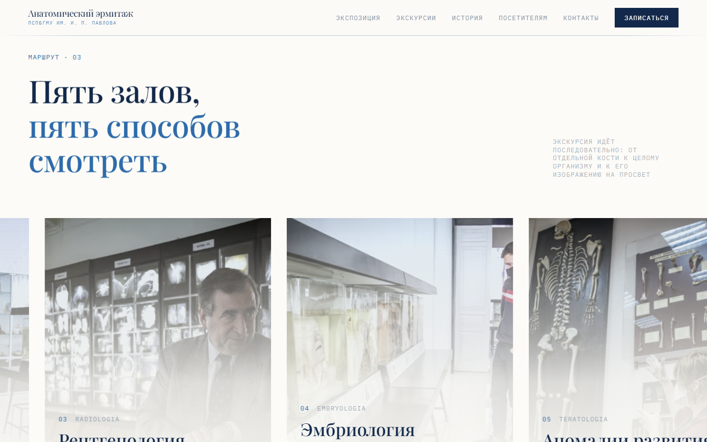 |
| 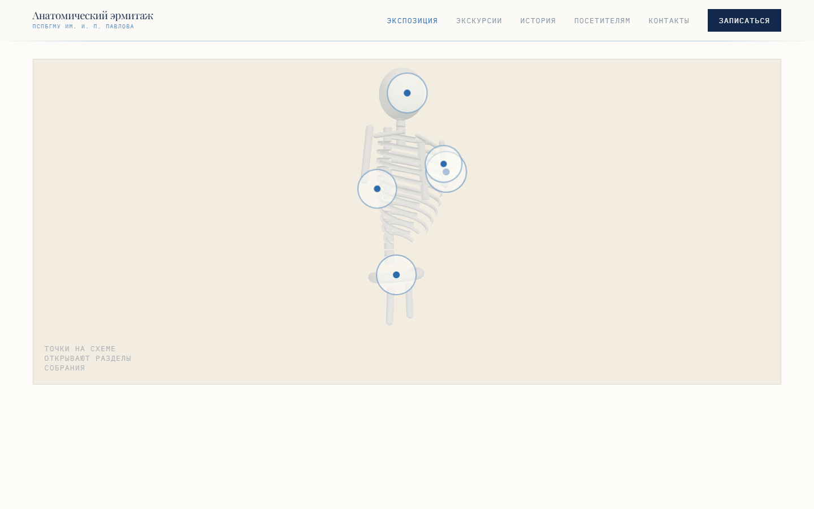 | 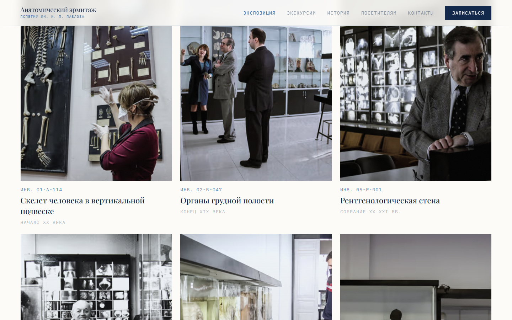 |
| 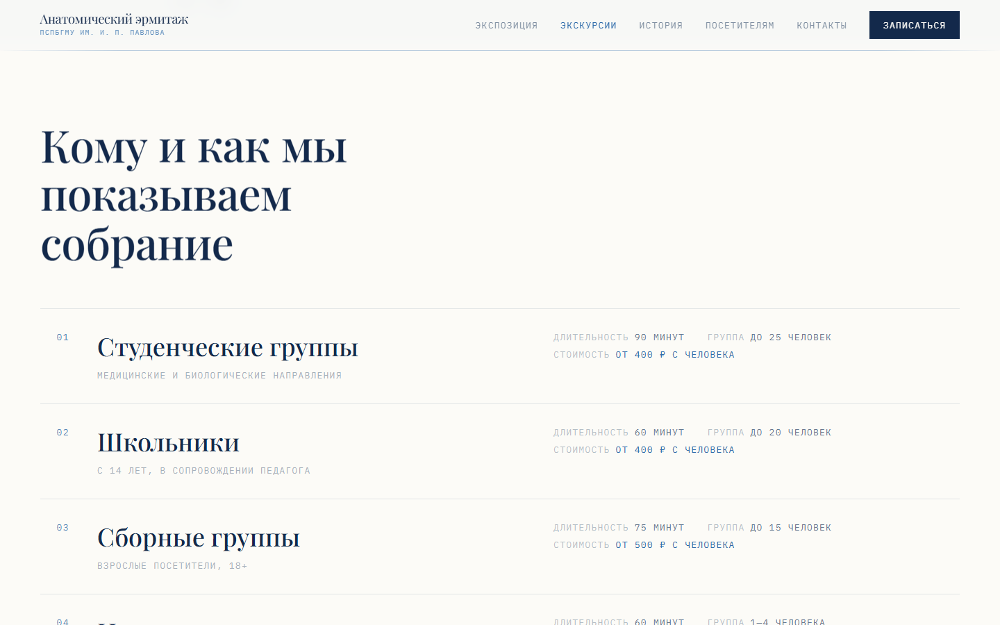 | 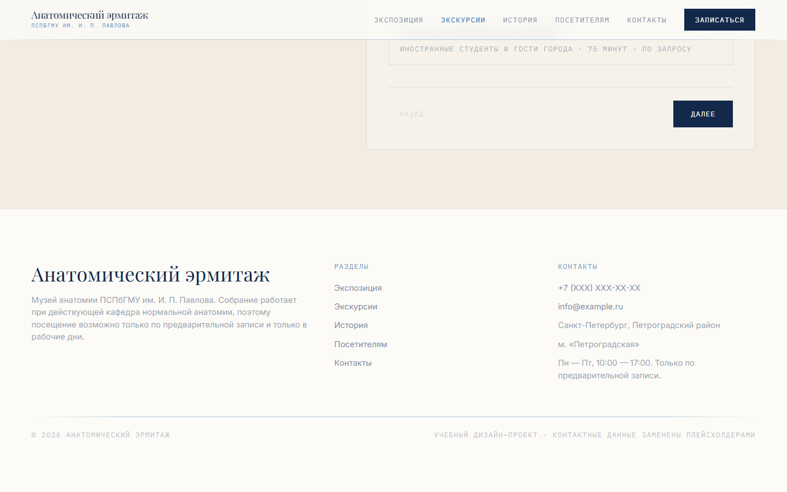 |
| 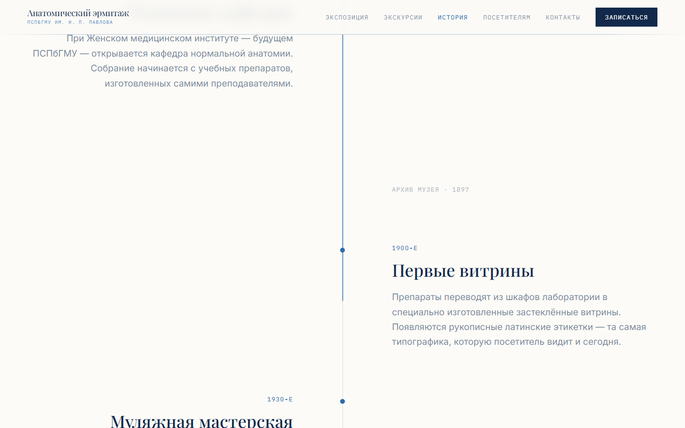 | 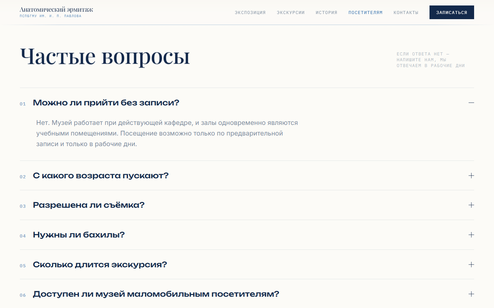 |
| 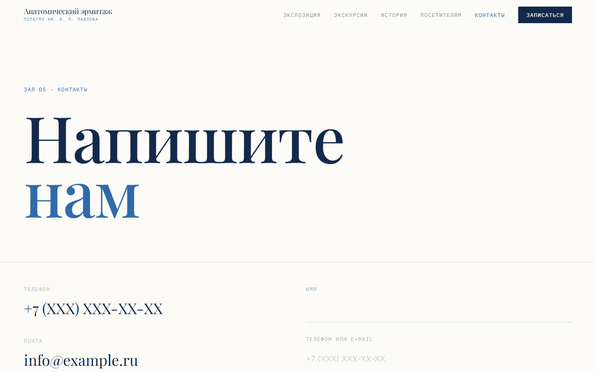 | 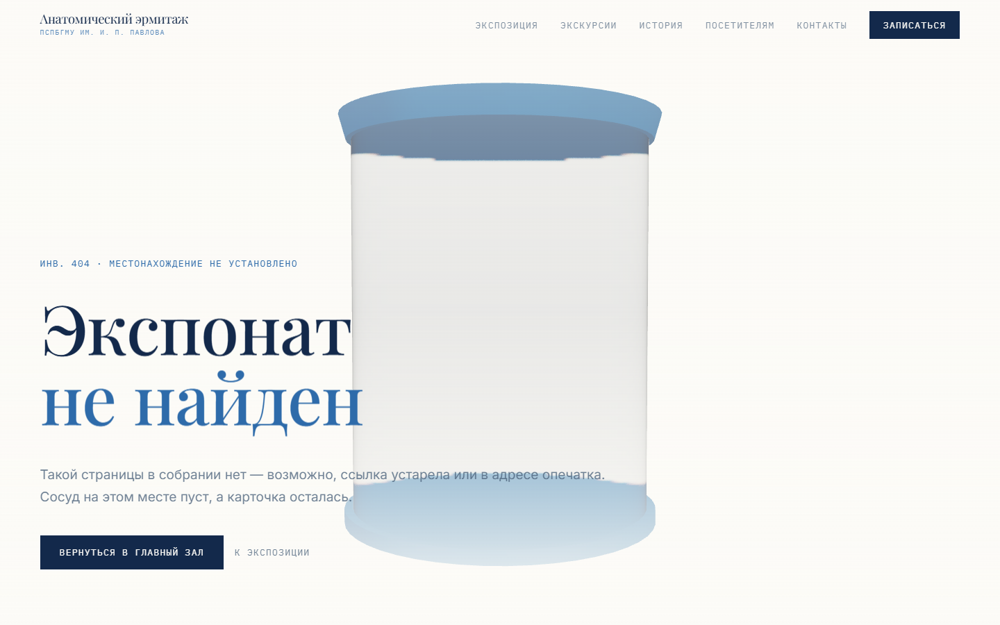 |
| 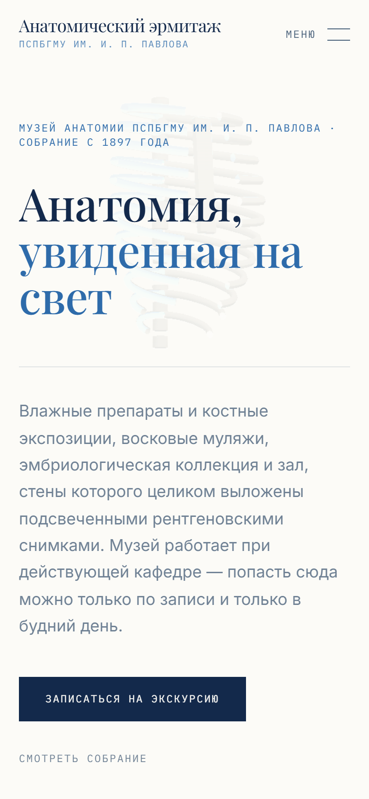 | 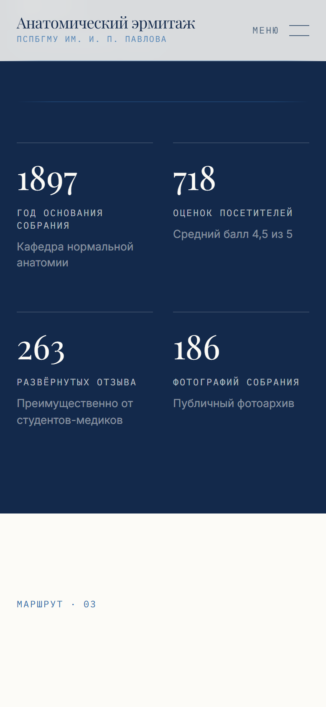 |

---

## Запуск

```bash
npm install
npm run dev
```

Прод-сборка:

```bash
npm run build && npm run start
```

---

## Деплой на Vercel

1. Инициализировать репозиторий и запушить:

```bash
git init && git add . && git commit -m "Анатомический эрмитаж" && git branch -M main
```

2. Создать репозиторий на GitHub и добавить remote:

```bash
git remote add origin https://github.com/<username>/anatomical-hermitage.git && git push -u origin main
```

3. На vercel.com → **Add New → Project** → импортировать репозиторий. Framework
   определится автоматически (Next.js), команда сборки `next build`.
4. В **Settings → Environment Variables** добавить переменную из `.env.example`:

   | Переменная | Значение |
   | --- | --- |
   | `NEXT_PUBLIC_SITE_URL` | `https://<project>.vercel.app` |

   Она используется в `metadataBase`, OG-тегах, `sitemap.xml` и `robots.txt`.
5. **Deploy**. После первого деплоя вписать полученный URL сюда, в блок «Демо» вверху
   файла, и в переменную окружения.

---

## SEO и доступность

- Метатеги и OG на каждой странице, JSON-LD `Museum` с `aggregateRating`, `sitemap.xml`,
  `robots.txt`.
- Семантическая разметка, `aria-*` на аккордеоне, фильтрах, форме и hotspot-кнопках,
  скип-ссылка на основное содержание, видимые фокус-стили.
- Контраст основного текста и акцентов — не ниже AA.
- Изображения через `next/image` с явными `sizes`, 3D грузится лениво через `dynamic`
  с заглушкой.

---

## Что доработал бы дальше

- **Реальный бэкенд формы записи.** Сейчас это витринный прототип: сабмит имитирует
  ответ и показывает сводку заявки, ничего никуда не уходит. Нужна интеграция
  с расписанием кафедры, иначе главный сценарий сайта остаётся декоративным.
- **Настоящие данные вместо плейсхолдеров.** Телефон, почта, адрес и корпус намеренно
  заменены — при передаче музею их нужно подставить вместе с реальными датами вех
  в таймлайне.
- **Модель черепа в hero.** Грудная клетка читается, но череп был бы более узнаваемым
  символом анатомического собрания. Для этого нужна нормальная модель, а не примитивы —
  то есть выход за рамки «без внешних ассетов».
- **Фотосъёмка под сетку.** Имеющиеся кадры разного качества и пропорций; часть карточек
  залов держится на кропе. Полноценная съёмка залов сняла бы это ограничение.
- **Англоязычная версия** — в форматах экскурсий она заявлена, значит нужна и на сайте.

---

## Лицензия и права

Фотографии принадлежат музею и использованы в учебных целях. Контактные данные на сайте —
плейсхолдеры. Проект не является официальным сайтом ПСПбГМУ им. И. П. Павлова.
